# 🌿 EcoBazaar – Sustainable E-Commerce Platform

🌎 **EcoBazaar** is a full-stack eco-friendly e-commerce platform designed to promote **sustainable shopping habits**.  
The system follows a **secure, multi-role architecture** supporting **Admin**, **Seller**, and **User** workflows with intelligent eco-product insights.

The platform demonstrates real-world software engineering practices including **JWT authentication**, **AI-assisted eco recommendations**, **dynamic theming**, and **role-based dashboards**.

---

## 🌐 Live Deployment

🔹 **Frontend (Netlify)**  
👉 https://ecobazzar.netlify.app  

🔹 **Backend (Render + Neon PostgreSQL)**  
👉 Spring Boot REST APIs hosted on Render  
👉 PostgreSQL database powered by Neon Cloud  

---

## 🖼️ Application Preview

---

### 🏠 Home Pages

**Public Home (Before Login)**  
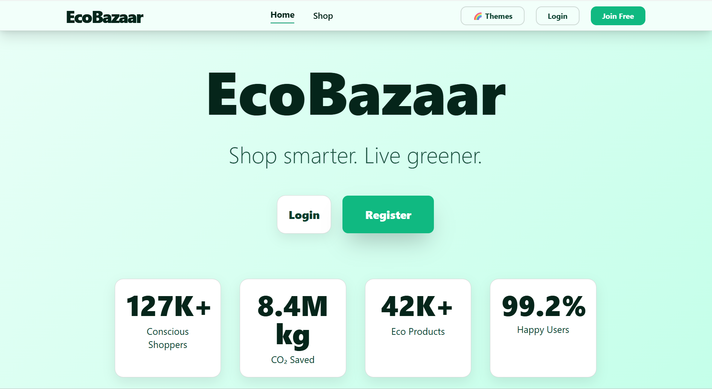

**User Home (After Login)**  
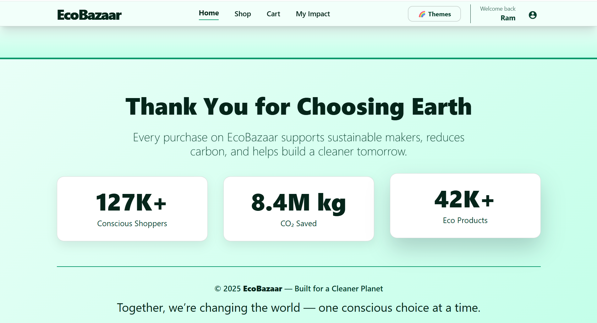

---

### 🛍️ Shopping Experience

**Product Marketplace**  
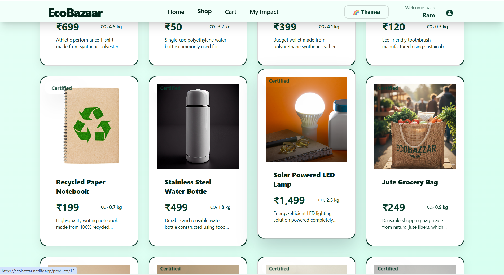

**Product Details & Eco Insights**  
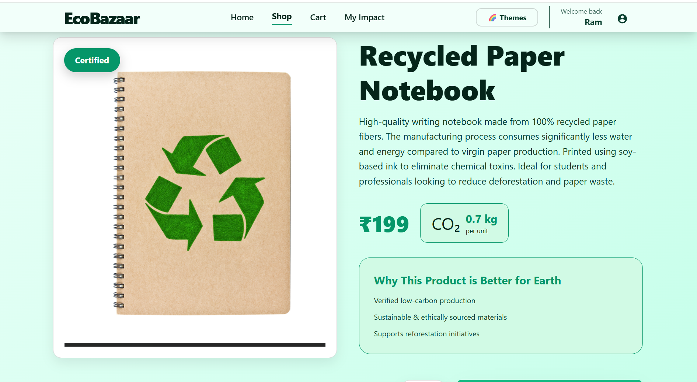

**Cart & Checkout Flow**  
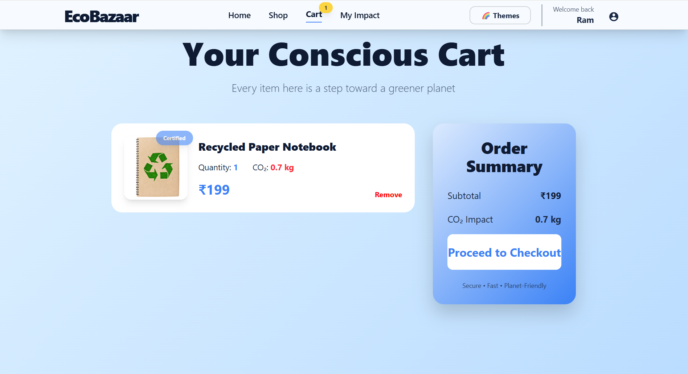

---

### 👤 User Dashboard

**User Sustainability Dashboard**  
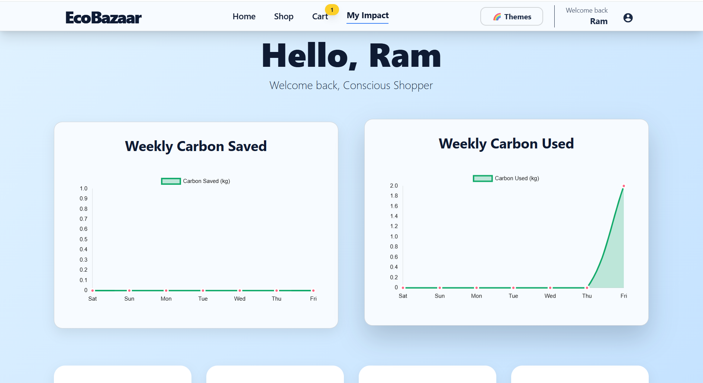

Features include:

- Carbon footprint tracking  
- Eco score monitoring  
- Weekly sustainability analytics  
- Purchase history insights  

---

### 🛒 Seller Portal

**Seller Product Management**  
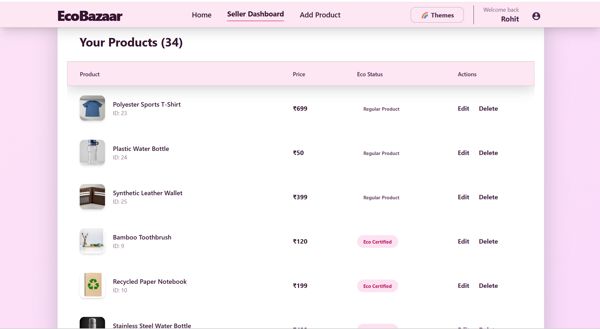

**Seller Performance Dashboard**  
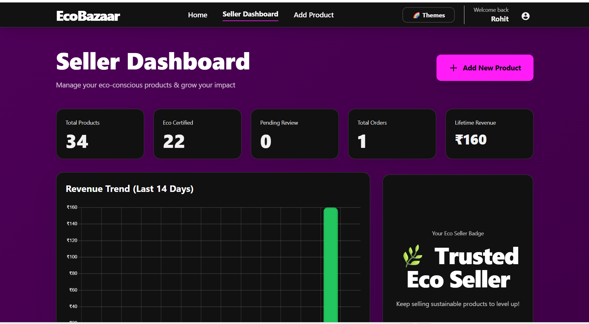

**Add / Manage Eco Products**  
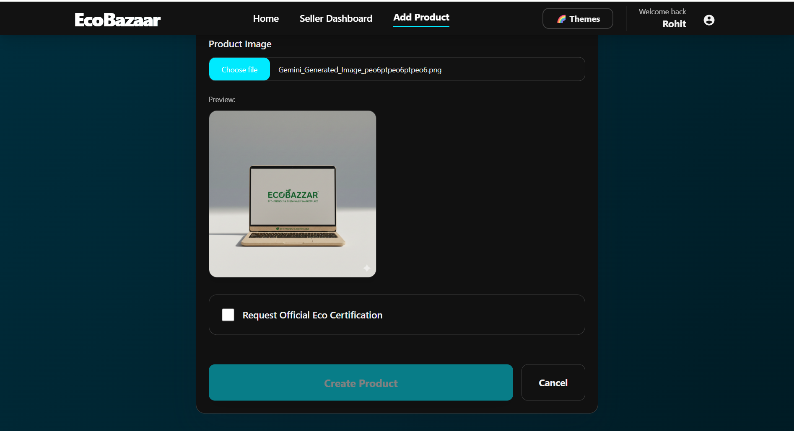

Seller capabilities include:

- Product listing & editing  
- Eco certification request submission  
- Sales analytics & reports  
- Inventory management  

---

### 👑 Admin Command Center

**Admin Dashboard & Platform Analytics**  
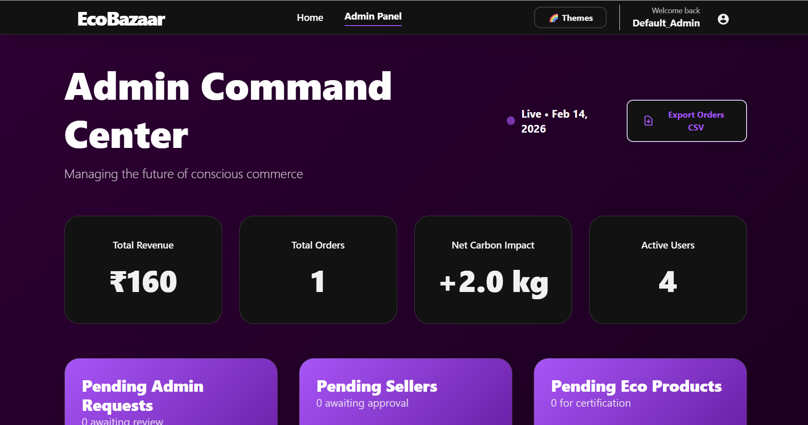

**Approval & Moderation Panel**  
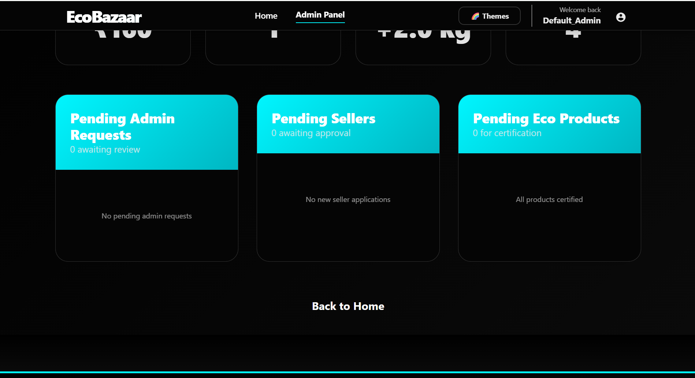

Admin controls:

- Approve eco-certification requests  
- Approve seller registration requests  
- Platform analytics & reporting  
- Product moderation  
- Role promotions  

---

### 🎨 Theme Support

EcoBazaar includes **10+ premium dynamic themes** including:

- Snow  
- Azure  
- Forest  
- Rose  
- Neon Pink  
- Neon Blue  
- Neon Purple  
- Dark Ocean  
- AMOLED Black  

**Theme Selector Interface**  
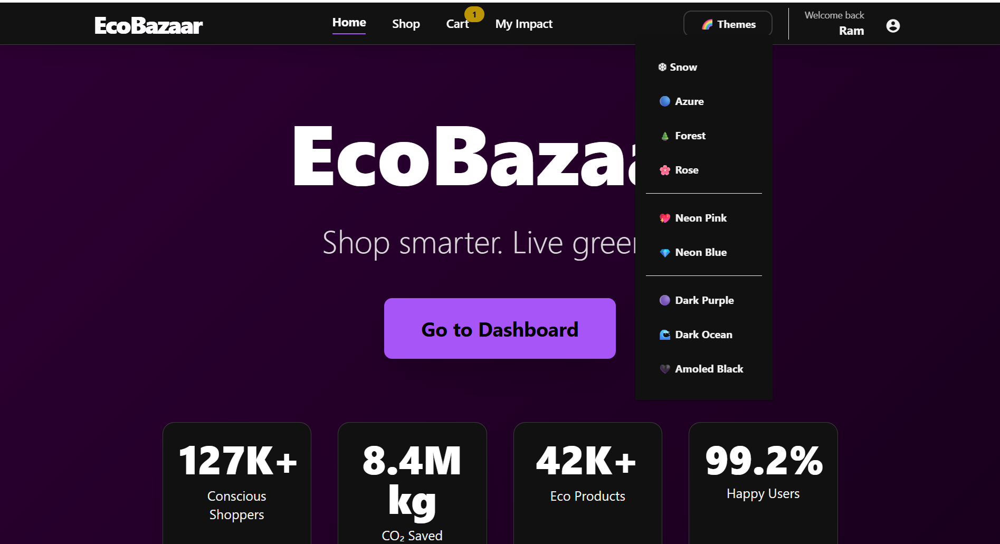

---

### 📱 Mobile Responsive UI

**Mobile Home View**  
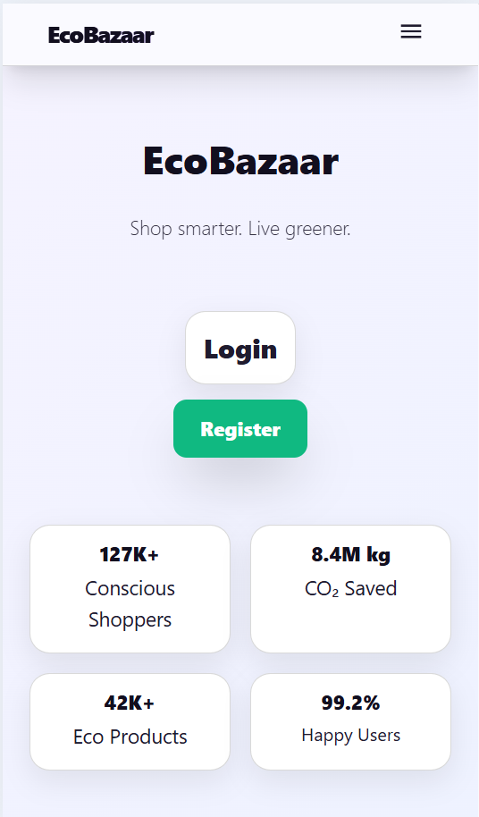

**Mobile Authentication UI**  
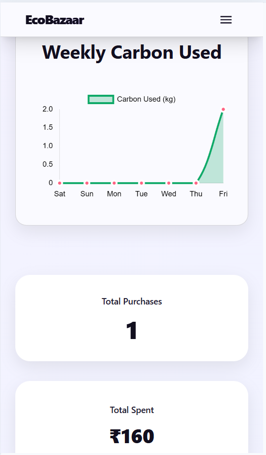

**Mobile Shopping Experience**  
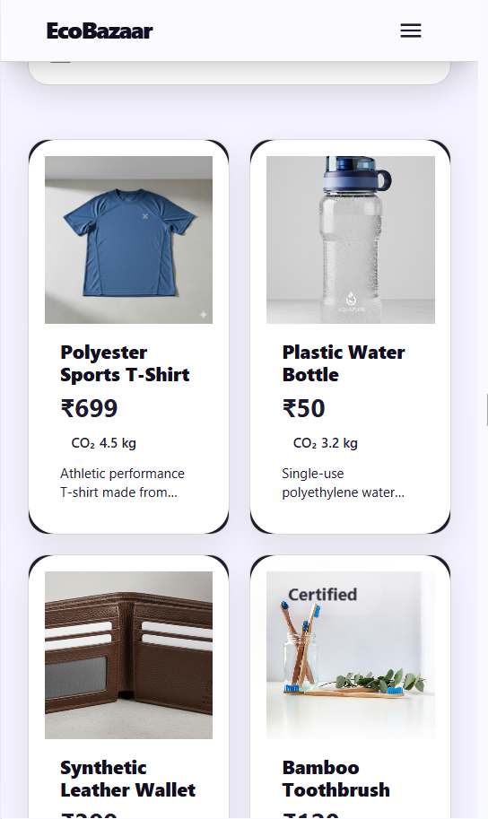

---

## ✨ Core Platform Features

---

### 👤 User Features

- 🔐 Secure JWT-based authentication  
- 🛍️ Browse eco & standard products  
- ♻️ AI-based eco alternative suggestions  
- 🛒 Smart cart management  
- 📊 Sustainability analytics dashboard  
- 🌱 Personal eco score tracking  
- 📦 Order history & checkout system  
- 🎨 Multi-theme UI customization  

---

### 🛒 Seller Features

- 📦 Product listing & inventory management  
- ♻️ Eco certification request submission  
- 📊 Sales analytics dashboard  
- 📈 Revenue & product performance reports  
- 🧾 Seller order tracking  
- 📉 Sustainability impact reporting  

---

### 👑 Admin Features

- 🧑‍💼 Role approval workflows  
- ♻️ Eco product certification moderation  
- 📊 Platform-wide analytics reporting  
- 🛍️ Product approval / rejection system  
- 📈 Order & sustainability reports export  
- 🔐 Admin access request approval system  

---

## 🤖 AI-Powered Eco Suggestions

EcoBazaar includes an intelligent eco recommendation system that:

- Detects non-eco products in cart  
- Suggests certified sustainable alternatives  
- Uses keyword similarity product matching  
- Promotes environmentally responsible purchasing  

---

## 🔐 Authentication & Security

EcoBazaar follows enterprise-grade security practices:

- 🔑 JWT token-based authentication  
- 🔒 BCrypt password hashing  
- 🛡 Role-based endpoint authorization  
- 🚫 Stateless session architecture  
- 🌐 CORS-secured API access  
- 👨‍💼 Admin approval flows for privilege escalation  

---

## 🧩 Technology Stack

### 🎨 Frontend
- Angular  
- Tailwind CSS + SCSS Theme Engine  
- Angular Material UI  
- Fully responsive UI  
- Premium animation & motion system  

### ⚙️ Backend
- Spring Boot (Java)  
- Spring Security  
- JWT Authentication  
- RESTful API Architecture  

### 🗄️ Database
- Neon Cloud PostgreSQL  
- JPA / Hibernate ORM  

### ☁️ Hosting & Deployment
- Netlify → Frontend deployment  
- Render → Backend API hosting  
- Neon → Managed PostgreSQL cloud database  

---

## 📊 Sustainability Analytics Engine

EcoBazaar tracks:

- Carbon impact per product  
- Weekly carbon usage vs savings  
- Seller eco contribution analytics  
- User eco score calculation  
- Platform sustainability reporting  

---

## 📱 UI / UX Highlights

- 🌈 Multi-theme premium UI system  
- ✨ Animated gradients & glow effects  
- 💻 Desktop optimized layout  
- 📱 Fully responsive mobile experience  
- 🔄 Smooth route transitions  
- 🎯 Accessibility focused design  

---

## 🚀 Deployment Behavior

- 🔁 Netlify auto-deploys frontend on Git push  
- 🔁 Render redeploys backend automatically  
- ⚠️ Free tier services may sleep after inactivity  

---

## 🧪 Known Limitations (Free Hosting Constraints)

- ❌ No external payment gateway integration  
- ❌ Email notification service not integrated  
- ❌ AI suggestions currently keyword-based  

---

## 🔮 Future Enhancements

- 🤖 Machine Learning eco recommendation engine  
- 💳 Payment gateway integration  
- 🔔 Email & notification service  
- 📦 Advanced inventory prediction  
- 🌍 Carbon offset tracking  
- 📱 Progressive Web App (PWA)  
- 🔐 OAuth / Social login support  

---

## 📘 Academic & Professional Use Case

EcoBazaar is ideal for:

- 🎓 Final Year Engineering Projects  
- 🌐 Full-Stack Enterprise Application Demonstrations  
- 🔐 Role-Based Security Architecture Learning  
- ♻️ Sustainable Technology Research  
- ☁️ Cloud Deployment Demonstrations  

---

## 📄 License

This project is licensed under the **MIT License**  
See the [LICENSE](LICENSE) file for details.

---

## ⭐ Final Note

EcoBazaar demonstrates how modern software engineering can merge **sustainability**, **AI assistance**, and **secure multi-role architecture** into a scalable e-commerce solution.

✨ Feel free to fork, contribute, and build a greener digital future! 🌍
